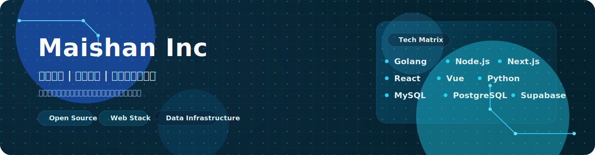
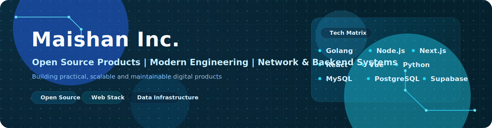

## Maishan Inc.

> 专注开源产品、现代工程与网络后端系统。

Maishan Inc. 致力于打造真正能落地的开源产品，覆盖邮件系统、搜索工具、自动化平台、Web 应用与后端服务。  
以工程质量为基础，以交付效率为驱动，在真实业务场景里持续迭代。

## 联系方式

- 官网：https://www.maishanzero.com
- X：https://x.com/MaishanInc
- 博客：https://blog.maishanzero.com/（开发中）
- 支持邮箱：support@maishanzero.com
- 中国大陆区：maishanemail@qq.com
- Telegram：开发中

## 技术版图

Golang · PHP · Node.js · Next.js · JavaScript · TypeScript · React · Vue · Python · MySQL · PostgreSQL · Supabase

## 公司成员介绍

<table>
  <tr>
    <td align="center" width="25%">
      <a href="https://github.com/Maishan-SecauDit">
         
        <strong>SecauDit</strong>
      </a> 
       
      负责安全审计、风险排查与开源项目安全基线建设。  
       
      
    </td>
    <td align="center" width="25%">
      <a href="https://github.com/raininlab">
         
        <strong>Raininlab</strong>
      </a> 
       
      负责信任治理、内容安全与组织协作安全机制设计。  
      
    </td>
    <td align="center" width="25%">
      <a href="https://github.com/CHUNXIAOKO">
         
        <strong>CHUN XIAO KO</strong>
      </a> 
       
      负责基础设施运行、环境维护与平台稳定性保障。  
      
    </td>
    <td align="center" width="25%">
       
      <strong>Freeanime.org</strong> 
       
      负责组织持有、域名管理与核心资源归属维护。  
      
    </td>
  </tr>
</table>

## 开源项目

  
  

### 关注方向

- 邮件管理系统与效率工具
- 搜索产品与信息流工作台
- 基于 Next.js、React、Vue 的现代 Web 应用
- 使用 Golang、Node.js、PHP、Python 构建后端与自动化能力
- 面向真实场景的开源工具与基础设施

## 常用许可证

- `CC BY-NC 4.0`：适合署名且禁止商业使用的内容型项目
- `MIT`：适合简洁宽松、开发者友好的开源项目
- `Apache-2.0`：适合需要专利授权说明的宽松型项目

## 愿景

> 争取成为 WEB3 时代优秀的初创公司。

[返回顶部](#top) | [切换到 English](#english-profile)

---

  

## English Profile

> Focused on open-source products, modern engineering, and network backend systems.

Maishan Inc. builds practical software across email systems, search tools, automation workflows, web applications, and backend infrastructure.  
The goal is clear: ship faster, engineer better, and keep products useful in real operating environments.

## Contact

- Website: https://www.maishanzero.com
- X: https://x.com/MaishanInc
- Blog: https://blog.maishanzero.com/ (under development)
- Support: support@maishanzero.com
- Mainland China: maishanemail@qq.com
- Telegram: coming soon

## Technology

Golang · PHP · Node.js · Next.js · JavaScript · TypeScript · React · Vue · Python · MySQL · PostgreSQL · Supabase

## Team

<table>
  <tr>
    <td align="center" width="25%">
      <a href="https://github.com/Maishan-SecauDit">
         
        <strong>SecauDit</strong>
      </a> 
       
      Leads security reviews, risk analysis, and baseline protection for open-source systems.  
       
      
    </td>
    <td align="center" width="25%">
      <a href="https://github.com/raininlab">
         
        <strong>Raininlab</strong>
      </a> 
       
      Leads trust governance, content safety, and secure collaboration standards.  
      
    </td>
    <td align="center" width="25%">
      <a href="https://github.com/CHUNXIAOKO">
         
        <strong>CHUN XIAO KO</strong>
      </a> 
       
      Leads infrastructure operations, environment maintenance, and platform stability.  
      
    </td>
    <td align="center" width="25%">
       
      <strong>Freeanime.org</strong> 
       
      Maintains organization ownership, domain assets, and core resource stewardship.  
      
    </td>
  </tr>
</table>

## Open Source Projects

- [Microsoft-Email-Manager](https://github.com/Maishan-Inc/Microsoft-Email-Manager)
- [Limitless-search](https://github.com/Maishan-Inc/Limitless-search)

## Preferred Licenses

- `CC BY-NC 4.0`
- `MIT`
- `Apache-2.0`

## Vision

> Striving to become an outstanding startup in the Web3 era.

[Back to Top](#top) | [切换到中文](#中文主页)

